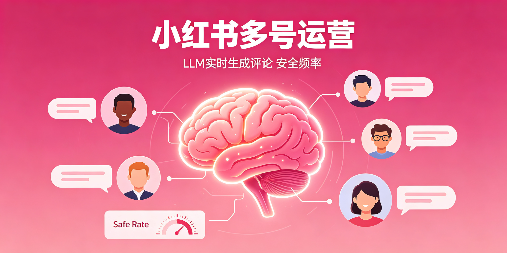

# xiaohongshu-account-operations

**多账号小红书评论运营：LLM 实时生成 + 去AI味 + 人设配置 + 频率安全 + 安全兜底 + 质量闭环。**

  
  
  

## 架构

- 评论 = LLM 实时生成（读帖→现写→去AI味→校验→发布）
- **🧬 评论去AI味**：融合 blader/humanizer v3.0.0 + doubao-human-signal，发布前强制过滤 10 类 AI 味模式（万能句式/三连/升华/空洞夸赞等），校验链 5 道关卡
- 每个账号一套人设 + 禁词表
- 校验链：空内容→跳过；万能词→重试 3 次；链接/超长→跳过；AI味≥3处→重写
- **🛑 安全兜底**：自动停轮（连续失败 / 限流信号一触发即停 + 告警）、降频档位（异常升档、正常回档）、冻结回档（恢复期只降不升）
- **👁 静默限流检测**：双账号视角对比识别"分发降权"，附四阶段恢复路径

## 去AI味（v1.2.0）

让评论"像真人写的"而不是"像 AI 写的"——四维度：具体性 / 个人视角 / 结构自由度 / 信息差。
详细规则见 `references/humanize-comments.md`。

## 安全兜底与静默限流（v1.3.0）

- **自动停轮（硬保险）**：①连续失败 ②响应出现限流/验证信号 ③健康监控失败率超线 → 写停轮标志 + 告警 + 全部轮次跳过；恢复需先定位原因，不盲目重跑
- **降频档位 + 保守档 + 冻结回档**：level 0/1/2 自动升降；恢复期只跑部分轮次、单轮 ≤10 条、收藏置 0；冻结标志存在时只降不升
- **静默限流检测**：笔记"自己可见、他人不可见"= 分发降权（无申诉入口）；检测 = 双账号视角差值 + 搜索命中；恢复四阶段：改私密 → 停更养号 → 低频生活帖 → 长期零交易词

## License

MIT
